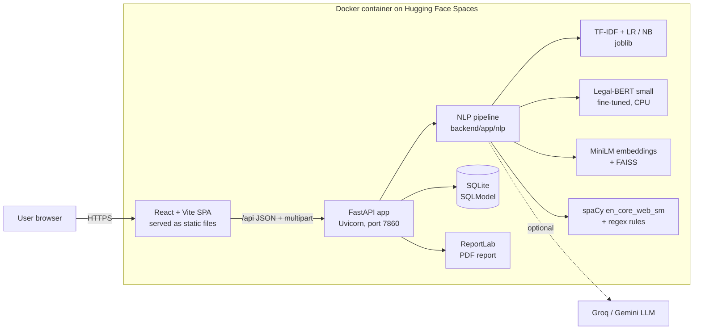
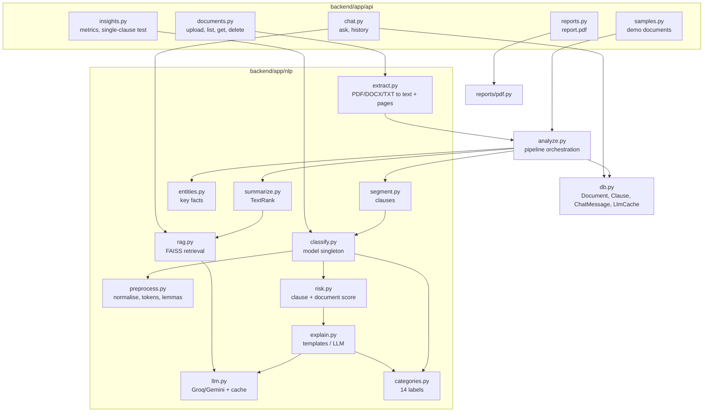
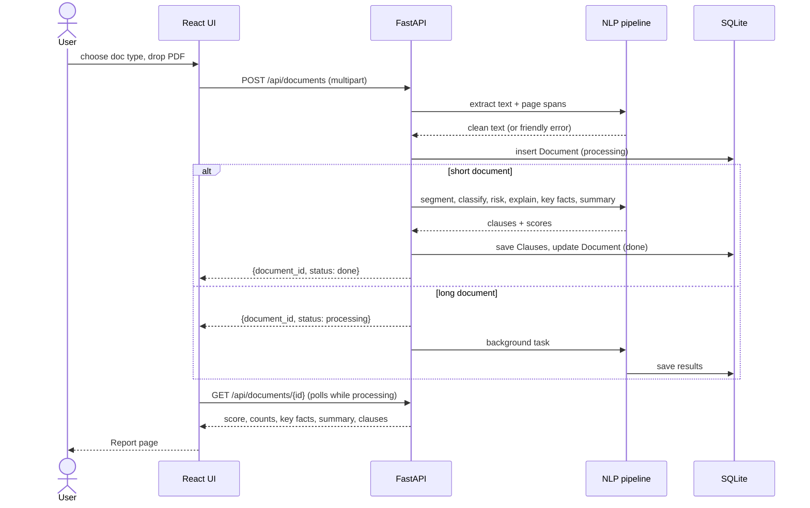
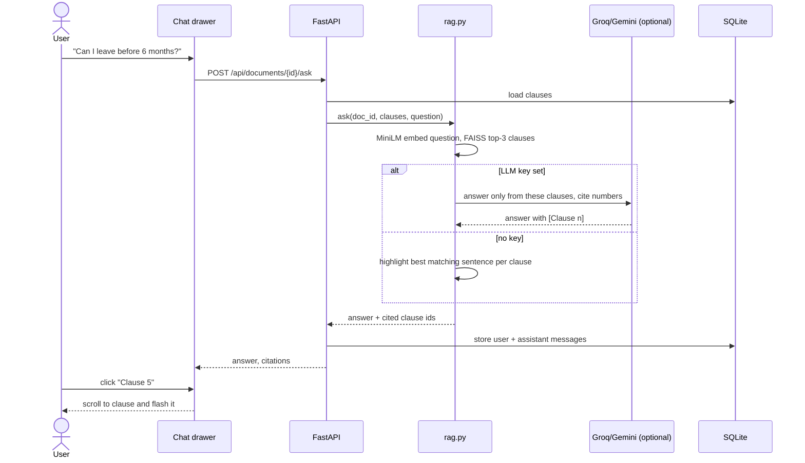

# ClauseGuard architecture

## System architecture

```mermaid
flowchart LR
    U[User browser] -->|HTTPS| F[React + Vite SPA<br/>served as static files]
    F -->|/api JSON + multipart| A[FastAPI app<br/>Uvicorn, port 7860]
    A --> P[NLP pipeline<br/>backend/app/nlp]
    A --> DB[(SQLite<br/>SQLModel)]
    A --> R[ReportLab<br/>PDF report]
    P --> M1[TF-IDF + LR / NB<br/>joblib]
    P --> M2[Legal-BERT small<br/>fine-tuned, CPU]
    P --> M3[MiniLM embeddings<br/>+ FAISS]
    P --> M4[spaCy en_core_web_sm<br/>+ regex rules]
    P -.optional.-> L[Groq / Gemini LLM]
    subgraph Docker container on Hugging Face Spaces
        F
        A
        P
        DB
        R
        M1
        M2
        M3
        M4
    end
```

## Component diagram

```mermaid
flowchart TB
    subgraph api[backend/app/api]
        documents[documents.py<br/>upload, list, get, delete]
        chat[chat.py<br/>ask, history]
        reports[reports.py<br/>report.pdf]
        samples[samples.py<br/>demo documents]
        insights[insights.py<br/>metrics, single-clause test]
    end
    subgraph nlp[backend/app/nlp]
        extract[extract.py<br/>PDF/DOCX/TXT to text + pages]
        segment[segment.py<br/>clauses]
        preprocess[preprocess.py<br/>normalise, tokens, lemmas]
        classify[classify.py<br/>model singleton]
        risk[risk.py<br/>clause + document score]
        explain[explain.py<br/>templates / LLM]
        entities[entities.py<br/>key facts]
        summarize[summarize.py<br/>TextRank]
        rag[rag.py<br/>FAISS retrieval]
        llm[llm.py<br/>Groq/Gemini + cache]
        categories[categories.py<br/>14 labels]
    end
    analyze[analyze.py<br/>pipeline orchestration]
    db[db.py<br/>Document, Clause, ChatMessage, LlmCache]
    pdf[reports/pdf.py]

    documents --> extract --> analyze
    samples --> analyze
    analyze --> segment --> classify --> risk --> explain
    analyze --> entities
    analyze --> summarize --> rag
    classify --> preprocess
    explain --> llm
    chat --> rag --> llm
    reports --> pdf
    insights --> classify
    analyze --> db
    chat --> db
    classify --> categories
    explain --> categories
```

## Sequence: upload to report

```mermaid
sequenceDiagram
    actor User
    participant UI as React UI
    participant API as FastAPI
    participant NLP as NLP pipeline
    participant DB as SQLite
    User->>UI: choose doc type, drop PDF
    UI->>API: POST /api/documents (multipart)
    API->>NLP: extract text + page spans
    NLP-->>API: clean text (or friendly error)
    API->>DB: insert Document (processing)
    alt short document
        API->>NLP: segment, classify, risk, explain, key facts, summary
        NLP-->>API: clauses + scores
        API->>DB: save Clauses, update Document (done)
        API-->>UI: {document_id, status: done}
    else long document
        API-->>UI: {document_id, status: processing}
        API->>NLP: background task
        NLP->>DB: save results
    end
    UI->>API: GET /api/documents/{id} (polls while processing)
    API-->>UI: score, counts, key facts, summary, clauses
    UI-->>User: Report page
```

## Sequence: Ask ClauseGuard

```mermaid
sequenceDiagram
    actor User
    participant UI as Chat drawer
    participant API as FastAPI
    participant RAG as rag.py
    participant LLM as Groq/Gemini (optional)
    participant DB as SQLite
    User->>UI: "Can I leave before 6 months?"
    UI->>API: POST /api/documents/{id}/ask
    API->>DB: load clauses
    API->>RAG: ask(doc_id, clauses, question)
    RAG->>RAG: MiniLM embed question, FAISS top-3 clauses
    alt LLM key set
        RAG->>LLM: answer only from these clauses, cite numbers
        LLM-->>RAG: answer with [Clause n]
    else no key
        RAG->>RAG: highlight best matching sentence per clause
    end
    RAG-->>API: answer + cited clause ids
    API->>DB: store user + assistant messages
    API-->>UI: answer, citations
    User->>UI: click "Clause 5"
    UI-->>User: scroll to clause and flash it
```
